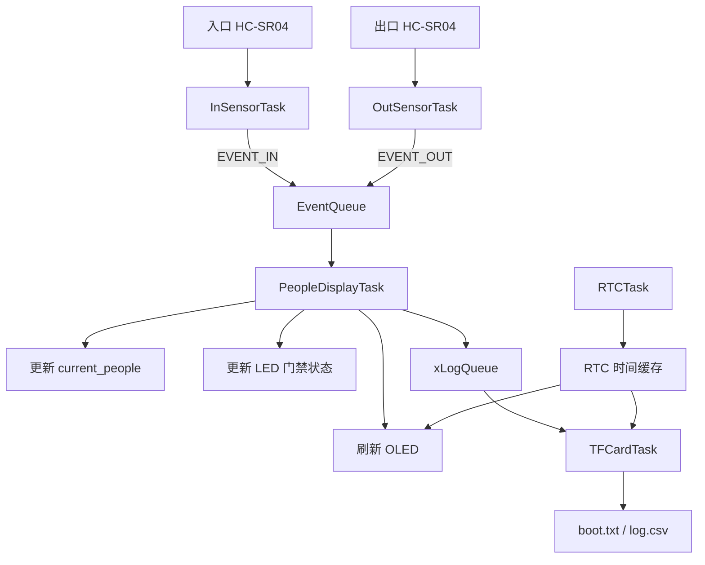

# FreeRTOS 仓库人员数量统计与门禁系统

基于 STM32F103C8T6、FreeRTOS、双路 HC-SR04、OLED、RTC 和 TF 卡实现的仓库人员数量统计与门禁系统。

系统通过入口和出口两路超声波传感器检测人员进出，使用 FreeRTOS 任务、消息队列和互斥锁完成并发处理，并在 OLED 上实时显示仓库人数与时间。当人数达到上限时，系统点亮门禁状态 LED，并对继续进入的行为发出蜂鸣提示。人员变化和周期状态会保存到 TF 卡的 CSV 日志中。

## 功能特性

- 双路 HC-SR04 分别检测入口和出口人员。
- 实时统计仓库当前人数，人数不会低于 0 或超过设定上限。
- OLED 实时显示当前人数、最大人数和 RTC 时间。
- 人数达到上限时点亮 LED，表示门禁锁止。
- 满员状态下再次检测到入口人员时，蜂鸣器发出提示音。
- RTC 每秒更新时间，为显示和日志提供时间戳。
- TF 卡上电后创建或追加 `boot.txt`。
- 每 5 秒向 `log.csv` 写入人员事件和当前状态。
- 使用 FreeRTOS 消息队列传递进出事件和日志数据。
- 使用互斥锁保护人数变量及两路超声波测距过程。
- 支持 STM32CubeMX、Keil MDK-ARM 和 IAR 工程。

## 硬件组成

| 模块 | 说明 |
| --- | --- |
| 主控 | STM32F103C8T6 |
| 操作系统 | FreeRTOS |
| 入口传感器 | HC-SR04 |
| 出口传感器 | HC-SR04 |
| 显示模块 | 0.96 英寸 I2C OLED，默认地址 `0x3C` |
| 存储模块 | SPI TF/SD 卡模块 |
| 时钟 | STM32 RTC + 32.768 kHz LSE |
| 状态提示 | LED、蜂鸣器 |

## 引脚连接

### 基础控制引脚

| 功能 | STM32 引脚 | 方向 | 说明 |
| --- | --- | --- | --- |
| LED | PA0 | 输出 | 低电平点亮，表示人数已满 |
| 蜂鸣器 | PA1 | 输出 | 高电平鸣叫 |
| TF 卡 CS | PA4 | 输出 | SPI 片选，低电平有效 |
| 入口 HC-SR04 TRIG | PB0 | 输出 | 入口测距触发信号 |
| 出口 HC-SR04 TRIG | PB1 | 输出 | 出口测距触发信号 |

### OLED（I2C1 重映射）

| OLED | STM32 引脚 |
| --- | --- |
| SCL | PB8 |
| SDA | PB9 |
| VCC | 3.3 V 或模块规定电压 |
| GND | GND |

### TF 卡（SPI1 重映射）

| TF 卡模块 | STM32 引脚 |
| --- | --- |
| CS | PA4 |
| SCK/CLK | PB3 |
| MISO/DO | PB4 |
| MOSI/DI | PB5 |
| VCC | 按模块要求供电 |
| GND | GND |

### HC-SR04

| 传感器 | TRIG | ECHO |
| --- | --- | --- |
| 入口传感器 | PB0 | PA6 / TIM3_CH1 |
| 出口传感器 | PB1 | PA7 / TIM3_CH2 |

> HC-SR04 的 ECHO 通常为 5 V 电平。连接 STM32 前应使用分压电阻或电平转换电路，将输入电压降低到安全范围。

> PB3、PB4 默认与 JTAG 功能复用。工程关闭 JTAG 并保留 SWD，以便这些引脚用于 SPI1，同时仍可通过 SWD 下载和调试。

## 系统参数

主要参数位于 `Core/Src/main.c`：

```c
#define MAX_PEOPLE          5
#define DISTANCE_THRESHOLD  20.0f
#define DEBOUNCE_MS         1000U
```

- `MAX_PEOPLE`：允许进入仓库的最大人数。
- `DISTANCE_THRESHOLD`：判断检测到人员的距离阈值，单位为厘米。
- `DEBOUNCE_MS`：同一路传感器两次有效触发之间的最短间隔。

RTC 初始时间也在 `Core/Src/main.c` 中设置：

```c
#define RTC_SET_YEAR        2026U
#define RTC_SET_MONTH       6U
#define RTC_SET_DATE        16U
#define RTC_SET_HOUR        16U
#define RTC_SET_MINUTE      48U
#define RTC_SET_SECOND      0U
#define RTC_FORCE_SET_ON_BOOT  1U
```

`RTC_FORCE_SET_ON_BOOT` 的含义：

- 设置为 `1`：每次上电或复位都重新写入上述时间，适合调试和演示前校时。
- 设置为 `0`：仅在备份寄存器无效时设置时间，适合连接 VBAT 电池后长期运行。

## FreeRTOS 任务设计

| 任务 | 优先级 | 栈大小 | 主要职责 |
| --- | --- | --- | --- |
| `InSensorTask` | AboveNormal | 256 | 检测入口距离，判断是否允许进入 |
| `OutSensorTask` | AboveNormal | 256 | 检测出口距离并发送离开事件 |
| `PeopleDisplayTask` | Normal | 256 | 更新人数、门禁状态、OLED 和日志队列 |
| `RTCTask` | Low | 128 | 每秒读取 RTC 并更新时间缓存 |
| `TFCardTask` | BelowNormal | 1024 | 挂载 TF 卡并每 5 秒写入日志 |

### 队列与互斥锁

- `EventQueueHandle`：入口、出口任务向人数处理任务发送 `EVENT_IN` 和 `EVENT_OUT`。
- `xLogQueue`：人数处理任务把带时间戳的事件发送给 TF 卡任务。
- `peopleMutexHandle`：保护共享变量 `current_people`。
- `measureMutexHandle`：避免两路 HC-SR04 同时测距产生串扰或争用 TIM3。



## 超声波测距原理

1. 测距任务向对应 HC-SR04 的 TRIG 引脚发送约 10 μs 高电平脉冲。
2. TIM3 首先捕获 ECHO 上升沿并记录计数值。
3. 捕获极性切换为下降沿。
4. TIM3 捕获 ECHO 下降沿并计算高电平持续时间。
5. 根据声速换算距离：

```c
distance_cm = pulse_width_us * 0.0343f / 2.0f;
```

除以 2 是因为声波经过了“发射到目标”和“目标返回传感器”两段路程。

## TF 卡日志

建议使用 FAT16 或 FAT32 格式的 TF 卡。

### boot.txt

系统启动并成功挂载 TF 卡后，会追加一行启动记录：

```text
System boot, SD OK, 16:48:03
```

### log.csv

任务每 5 秒打开并追加 `log.csv`。人员进出事件示例：

```text
2026-06-16 16:49:10, IN, People=1
2026-06-16 16:49:25, OUT, People=0
```

即使没有人员进出，系统也会定期写入当前状态：

```text
2026-06-16 16:49:30, STAT, People=0
```

每轮写入后调用 `f_sync()`，降低突然断电或拔卡造成日志仍停留在缓存中的风险。

## 项目目录

```text
.
├─ Core/
│  ├─ Inc/
│  │  ├─ main.h                 引脚定义
│  │  ├─ FreeRTOSConfig.h       FreeRTOS 配置
│  │  ├─ oled_user.h            OLED 接口
│  │  └─ sd_spi.h               SD SPI 接口
│  └─ Src/
│     ├─ main.c                 系统主逻辑、任务和测距中断
│     ├─ freertos.c             FreeRTOS 静态内存支持
│     ├─ oled_user.c            OLED 显示驱动
│     ├─ sd_spi.c               SD 卡 SPI 底层驱动
│     └─ stm32f1xx_hal_msp.c    外设引脚和中断配置
├─ FATFS/
│  ├─ App/fatfs.c               FatFs 初始化与文件时间
│  └─ Target/user_diskio.c      FatFs 到 SD SPI 的适配层
├─ Middlewares/                 FreeRTOS 与 FatFs 源码
├─ Drivers/                     STM32 HAL 和 CMSIS
├─ MDK-ARM/                     Keil 工程
├─ EWARM/                       IAR 工程
└─ warehouse_people_number.ioc  STM32CubeMX 工程配置
```

## 编译与烧录

### Keil MDK-ARM

1. 安装 STM32F1 对应的 Keil Device Pack。
2. 打开：

   ```text
   MDK-ARM/warehouse_people_number.uvprojx
   ```

3. 选择正确的调试器，例如 ST-Link。
4. 编译工程并通过 SWD 下载到 STM32F103C8T6。
5. 保留 SWD 调试接口，不要恢复完整 JTAG，否则 PB3/PB4 可能无法用于 SPI1。

### STM32CubeMX

使用以下文件查看或调整外设配置：

```text
warehouse_people_number.ioc
```

重新生成代码前，请确认自定义逻辑位于 CubeMX 的 `USER CODE BEGIN/END` 区域，避免被覆盖。

## 上电运行流程

1. 初始化 HAL、系统时钟和 GPIO。
2. 初始化 OLED、RTC、SPI1、TIM3 和 FatFs。
3. 创建人数互斥锁、测距互斥锁及两个消息队列。
4. 创建五个 FreeRTOS 任务并启动调度器。
5. OLED 开始显示当前人数和时间。
6. 入口、出口任务循环测量距离。
7. 人数发生变化时更新门禁状态并生成日志事件。
8. TF 卡任务每 5 秒写入事件和当前人数状态。

## 使用注意事项

- 第一次运行前根据实际时间修改 RTC 初始值。
- TF 卡模块必须与 STM32 共地。
- 裸 TF 卡只能使用 3.3 V；如果模块带稳压和电平转换，请按模块标注供电。
- OLED 无显示时检查 I2C 地址是否为 `0x3C`，以及 PB8/PB9 是否正确上拉。
- SD 卡无法挂载时重点检查 PA4、PB3、PB4、PB5 接线和 FAT 文件系统格式。
- 两个 HC-SR04 安装过近时可能互相串扰，工程使用互斥锁避免同时触发，但仍应合理布置传感器方向。
- 当前门禁执行器以 LED 表示。如果连接继电器、电磁锁或舵机，应增加驱动和保护电路，不能直接由 STM32 GPIO 驱动大功率负载。

## 许可证

项目中 STM32 HAL、CMSIS、FreeRTOS 和 FatFs 等第三方组件分别遵循其原始许可证。自定义业务代码的许可证可由仓库维护者另行补充。
